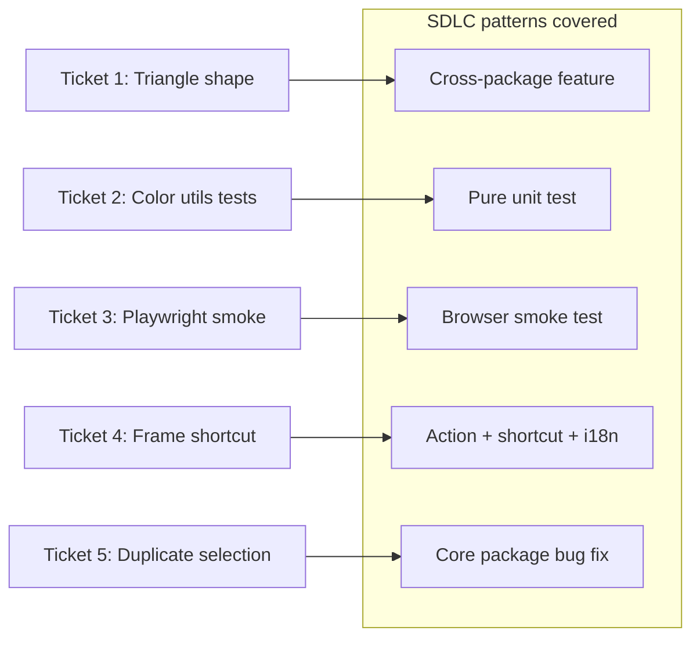

# SDLC Demo Ticket Backlog (5 tickets)

Five tickets designed as repeatable Cursor demo patterns. Each has clear acceptance criteria, known entry files, and a distinct SDLC slice. Estimated total effort: ~6–8 hours if done sequentially.




---

## Ticket 1 — Add triangle shape tool (minimal scope)

**SDLC pattern:** Cross-package feature development (types → geometry → rendering → UI → restore)

**Description:** Add a new `triangle` generic shape tool to the toolbar. Users can draw, select, resize, copy/paste, and export triangles. Follow the existing **diamond** pattern (polygon inscribed in the element bounding box). Out of scope for this ticket: rounded corners, bound text, arrow binding sectors, shape conversion popup, and non-English locale files (Crowdin handles those).

**Why triangle over hexagon:** Same wiring as any polygon shape, but only 3 vertices — less geometry code, still hits all the switch-state sites.

**Key files:**

- Type + unions: `[packages/element/src/types.ts](packages/element/src/types.ts)`
- Vertex math (model after `getDiamondPoints`): `[packages/element/src/bounds.ts](packages/element/src/bounds.ts)`
- Rough.js rendering: `[packages/element/src/shape.ts](packages/element/src/shape.ts)`
- Hit testing: `[packages/element/src/collision.ts](packages/element/src/collision.ts)`, `[packages/element/src/distance.ts](packages/element/src/distance.ts)`, `[packages/utils/src/shape.ts](packages/utils/src/shape.ts)`
- Type guards (many `case` additions): `[packages/element/src/typeChecks.ts](packages/element/src/typeChecks.ts)`, `[packages/element/src/comparisons.ts](packages/element/src/comparisons.ts)`
- Toolbar registration: `[packages/excalidraw/components/shapes.tsx](packages/excalidraw/components/shapes.tsx)`, `[packages/excalidraw/components/icons.tsx](packages/excalidraw/components/icons.tsx)`
- Tool constant: `[packages/common/src/constants.ts](packages/common/src/constants.ts)`
- Persistence: `[packages/excalidraw/data/restore.ts](packages/excalidraw/data/restore.ts)`
- Label: `[packages/excalidraw/locales/en.json](packages/excalidraw/locales/en.json)` (`toolBar.triangle`)

**Acceptance criteria:**

- Triangle appears in the shape toolbar with icon and label
- Drag-to-create produces a `type: "triangle"` element
- Element is selectable, movable, resizable, and included in copy/export
- `yarn test:typecheck` passes

**Effort:** ~1.5–2 hr (medium — repetitive wiring, not novel logic)

---

## Ticket 2 — Add unit tests for `normalizeInputColor`

**SDLC pattern:** Pure unit test in a core package (no React, no canvas)

**Description:** Extend color normalization coverage in `@excalidraw/common`. Add test cases for hex strings (3/6/8 digit), `rgb()` / `rgba()`, already-normalized values, and invalid/malformed input. Follow the existing style in `[packages/common/src/colors.test.ts](packages/common/src/colors.test.ts)`.

**Key files:**

- Implementation (read-only unless bugs found): `[packages/common/src/colors.ts](packages/common/src/colors.ts)`
- Tests: `[packages/common/src/colors.test.ts](packages/common/src/colors.test.ts)`

**Acceptance criteria:**

- At least 8 new `it()` blocks covering the cases above
- All assertions use `expect(...).toBe(...)` or `toEqual` — no snapshots needed
- `yarn test:app packages/common/src/colors.test.ts --watch=false` passes

**Effort:** ~20–30 min (small)

---

## Ticket 3 — Add Playwright smoke test: draw a rectangle on canvas

**SDLC pattern:** End-to-end test in a real browser (new test infra — repo currently has Vitest/jsdom only, no Playwright/Cypress)

**Description:** Introduce a minimal Playwright setup with one smoke spec that loads the dev app, selects the rectangle tool, performs a drag gesture on the interactive canvas, and asserts the scene contains one rectangle element. Use existing `data-testid` hooks (`toolbar-rectangle` from `[packages/excalidraw/components/Actions.tsx](packages/excalidraw/components/Actions.tsx)`) and the interactive canvas selector (`.interactive` canvas, same as `[packages/excalidraw/tests/dragCreate.test.tsx](packages/excalidraw/tests/dragCreate.test.tsx)`).

**Key files (new + modified):**

- New: `playwright.config.ts` (root) — `webServer` pointing at `yarn start`, base URL `http://localhost:3000` (confirm port in `[excalidraw-app/vite.config.mts](excalidraw-app/vite.config.mts)`)
- New: `e2e/smoke.spec.ts`
- Modified: `[package.json](package.json)` — add `@playwright/test` devDependency and `test:e2e` script

**Acceptance criteria:**

- `yarn test:e2e` starts the dev server, runs the spec, and exits 0
- Test verifies: toolbar tool selected → pointer drag on canvas → at least one element on scene (via `window.__EXCALIDRAW__` test hook if exposed, or by reading exported scene JSON from the app's global API — agent should inspect how test-utils accesses `h.elements` and mirror that in the browser context)
- CI note: optional follow-up to wire into `.github/workflows/` — out of scope for this ticket

**Effort:** ~45–60 min (small–medium — mostly boilerplate)

---

## Ticket 4 — Add keyboard shortcut for "Wrap selection in frame"

**SDLC pattern:** Action wiring + shortcuts + i18n + Help dialog (UI-adjacent feature, single vertical slice)

**Description:** The `wrapSelectionInFrame` action exists but has no keyboard shortcut (`[packages/excalidraw/actions/shortcuts.ts](packages/excalidraw/actions/shortcuts.ts)` shows an empty shortcut array). Assign `CtrlOrCmd+Shift+F`, add a `keyTest` handler on the action, document it in the Help dialog, and verify no conflict with existing bindings.

**Key files:**

- Action: `[packages/excalidraw/actions/actionFrame.ts](packages/excalidraw/actions/actionFrame.ts)`
- Shortcut map: `[packages/excalidraw/actions/shortcuts.ts](packages/excalidraw/actions/shortcuts.ts)`
- Key constants: `[packages/common/src/keys.ts](packages/common/src/keys.ts)`
- Help UI: `[packages/excalidraw/components/HelpDialog.tsx](packages/excalidraw/components/HelpDialog.tsx)`
- Label (already exists): `[packages/excalidraw/locales/en.json](packages/excalidraw/locales/en.json)` — `labels.wrapSelectionInFrame`

**Acceptance criteria:**

- With a selection on canvas, `Cmd/Ctrl+Shift+F` wraps it in a frame
- Shortcut appears in Help dialog (`?`) under the correct section
- No duplicate/conflicting shortcut registration
- Optional: one Vitest test using existing `API` + `fireEvent.keyDown` helpers in `[packages/excalidraw/tests/helpers/](packages/excalidraw/tests/helpers/)`

**Effort:** ~30–45 min (small)

---

## Ticket 5 — Fix duplicate selection over-selecting group siblings

**SDLC pattern:** Bug fix in core package with test-driven workflow (existing test documents expected behavior)

**Description:** When duplicating a single grouped element, the selection incorrectly expands to the entire group. Fix `selectGroupsForSelectedElements` logic in `@excalidraw/element` so only the duplicated clone is selected. The test file already exercises this scenario — look for FIXME / "shouldn't be selected" assertions in `[packages/excalidraw/actions/actionDuplicateSelection.test.tsx](packages/excalidraw/actions/actionDuplicateSelection.test.tsx)`.

**Key files:**

- Bug location: `[packages/element/src/groups.ts](packages/element/src/groups.ts)` (~lines 488–494 per existing test comments)
- Action (may need minor adjustment): `[packages/excalidraw/actions/actionDuplicateSelection.tsx](packages/excalidraw/actions/actionDuplicateSelection.tsx)`
- Test (update expectations / remove FIXME): `[packages/excalidraw/actions/actionDuplicateSelection.test.tsx](packages/excalidraw/actions/actionDuplicateSelection.test.tsx)`

**Acceptance criteria:**

- Duplicating one child of a group selects only the new clone, not sibling group members
- Existing duplicate tests pass; the previously failing case now passes
- `yarn test:app packages/excalidraw/actions/actionDuplicateSelection.test.tsx --watch=false` passes

**Effort:** ~30–60 min (small — localized logic change)

---

## Suggested demo order


| Order | Ticket                | Why                                                |
| ----- | --------------------- | -------------------------------------------------- |
| 1     | Ticket 2 (unit tests) | Warm-up; no UI, instant feedback loop              |
| 2     | Ticket 4 (shortcut)   | Shows action/search across a few files             |
| 3     | Ticket 5 (bug fix)    | TDD red → green with existing test                 |
| 4     | Ticket 3 (Playwright) | New infra; visually verifiable in browser          |
| 5     | Ticket 1 (triangle)   | Largest slice; benefits from familiarity with repo |


## Verification commands (all tickets)

```bash
yarn test:typecheck
yarn test:app --watch=false          # Vitest
yarn test:e2e                        # after Ticket 3 only
yarn fix                             # formatting/lint before commit
```

Per `[CLAUDE.md](CLAUDE.md)`: run `yarn test:update` if any snapshot tests change (likely none except possibly Ticket 1 if a render snapshot is added).